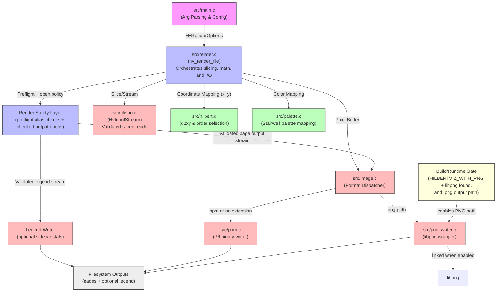

# Architecture: hilbertviz

The following diagram illustrates the flow of data and control from the CLI entry point down to the core algorithms and I/O handlers.

## Notes

- `PNG -> libpng` is conditional: this edge exists only when PNG support is
  enabled at build time (`HILBERTVIZ_WITH_PNG=ON`) and libpng is found.
